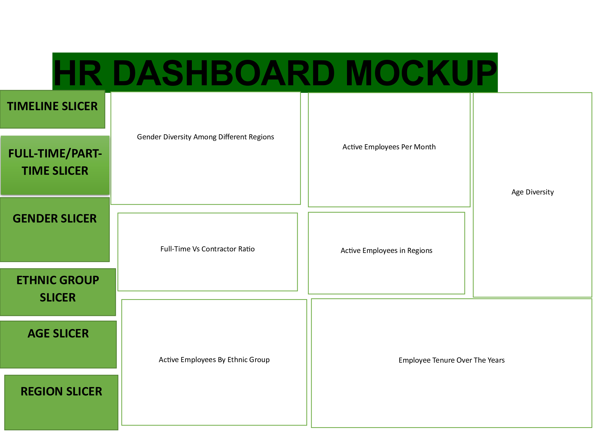

# HR_Dashboard_Visualization-
Data Visualization using Excel

## Project Description
*Introduction*

   Humanresources(HR)dashboards aggregate and present employee data in a meaningful way,and are designed to help give insight on the company’s human resources to the HR team and other teams in th eorganization.
   
   Dashboards are anefficient way to communicate with staff and stay abreast ofwhat’s happening in thecompany.
   
   As a visual display of keymetrics,HRdashboards simplify information gathering,and present data in a way that can be sorted,analyzed,and presented to management and executive teams.

   In this project,your task is to create a dashboard for the HRdepartment of an organization where you work as BI/DataAnalyst

# THE SITUATION  
  You are part of a BI/Analytics team in a big organization, you company asked you to work on a project to create a dashboard for the HR Department.
# THE BRIEF 
  The HR department want to track some KPIssuchasGender diversity (M/F), Full time employee vs Contractor ratio, Employee Age diversity, No of active employees per month, Active employees by Ethnic group, Active Employee by   Regions, Employee Tenure , etc .
  You’ve been given a folder of raw csv files, by theHRdepartmentcontaining information about Companyemployees.

# Deliverables for Submission
    •Develop a mock-up of your dashboard component layout with highlight of what you would want to put in each section
    •Design an interactive HR dashboard in Excel for the data (Note: You may have to merge the dataset you are given for the analysis into a single file using Power Query)
    •Your dashboard mockup
    •Your dashboard in excel
  # Dashboard Mockup  
  

  

  # HR Dashboard   
  

  

